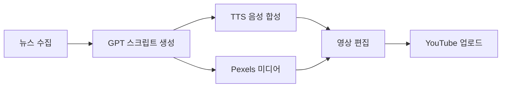

# YouTube Shorts 자동 생성 파이프라인

IT/테크 뉴스를 자동으로 수집해서 YouTube Shorts 영상으로 만들고 업로드하는 Python 파이프라인

## 파이프라인 구조



**뉴스 수집** → Google News RSS, 네이버 뉴스에서 IT/테크 뉴스 크롤링  
**스크립트 생성** → GPT-4o-mini가 쇼츠에 적합한 뉴스 선별 + 스크립트 작성  
**음성 합성** → Typecast API (한국어 자연스러움) 또는 Edge TTS (무료)  
**미디어 소싱** → Pexels API로 배경 영상/이미지 자동 수집  
**영상 편집** → FFmpeg/MoviePy로 세로형 쇼츠 렌더링  
**업로드** → YouTube Data API로 자동 업로드

## 빠른 시작

```bash
# 1. 클론 & 가상환경
git clone https://github.com/your-username/youtube-shorts-pipeline.git
cd youtube-shorts-pipeline
python -m venv venv
venv\Scripts\activate  # Windows
# source venv/bin/activate  # macOS/Linux

# 2. 의존성 설치
pip install -r requirements.txt

# 3. 환경 변수 설정
copy env.example.txt .env  # Windows
# cp env.example.txt .env  # macOS/Linux

# 4. .env 파일에 API 키 입력 후 실행
python main.py
```

## 환경 변수

| 변수명                       | 필수 | 설명                                    |
| ---------------------------- | ---- | --------------------------------------- |
| `OPENAI_API_KEY`             | ✅   | OpenAI API 키                           |
| `PEXELS_API_KEY`             | ✅   | Pexels API 키                           |
| `YOUTUBE_CLIENT_SECRET_FILE` | ✅   | OAuth 클라이언트 시크릿 경로            |
| `TYPECAST_API_KEY`           |      | Typecast API 키 (없으면 Edge TTS 사용)  |
| `TTS_PROVIDER`               |      | `typecast` 또는 `edge` (기본: typecast) |
| `DAILY_SHORTS_COUNT`         |      | 일일 생성 개수 (기본: 3)                |

## API 키 발급

### OpenAI

[platform.openai.com](https://platform.openai.com/) → API Keys → 새 키 생성

### Pexels

[pexels.com/api](https://www.pexels.com/api/) → 무료 계정 생성 → API 키 발급

### YouTube Data API

[Google Cloud Console](https://console.cloud.google.com/) → 프로젝트 생성 → YouTube Data API v3 활성화 → OAuth 2.0 클라이언트 ID 생성 → `client_secret.json` 다운로드

### Typecast (선택)

[typecast.ai](https://typecast.ai/) → 개발자 콘솔 → API 키 발급

## 로드맵

- [x] 프로젝트 구조 설정
- [ ] 뉴스 크롤링 모듈
- [ ] AI 스크립트 생성 모듈
- [ ] TTS 모듈
- [ ] 미디어 소싱 모듈
- [ ] 영상 편집 모듈
- [ ] YouTube 업로드 모듈
- [ ] 스케줄링

## 예상 비용

| 서비스   | 비용              |
| -------- | ----------------- |
| OpenAI   | ~$0.01/일         |
| Typecast | 월 9,900원 (선택) |
| Edge TTS | 무료              |
| Pexels   | 무료              |
| YouTube  | 무료              |

Edge TTS 사용 시 월 ~$0.30 (OpenAI만)
